# SkillSwap Hub

- [Project board](https://github.com/users/cstuart756/projects/10/views/1)
- [Live site](https://skillswap-hub-cstuart756-df93470f789d.herokuapp.com/)

## Overview

SkillSwap Hub is a Django-based full-stack web application for listing skills and creating exchange requests between users. It provides authentication, CRUD features, and a clean, accessible UI.

## Features

- User registration, login, and logout
- Skill listing and detail views
- Create, update, and delete skills
- Submit and track exchange requests
- Role-based access controls for protected actions
- Responsive, accessible UI with clear validation and feedback

## Final Product

### Desktop

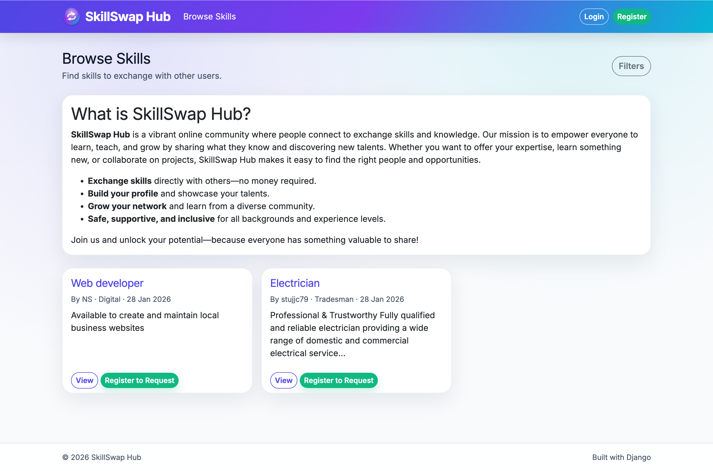

### Mobile

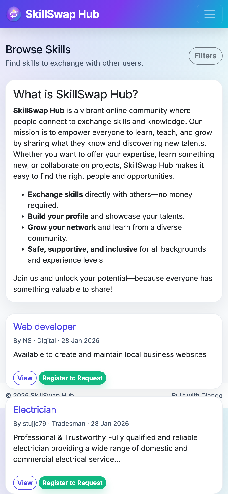

### Login

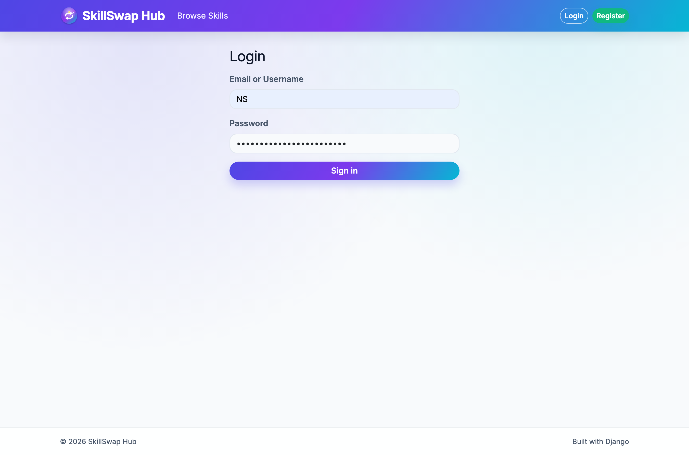

### Register

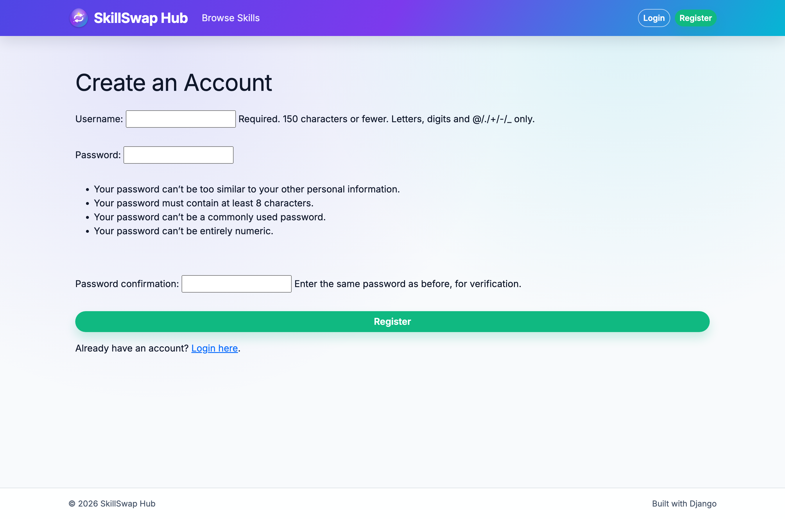

### Offer Skill

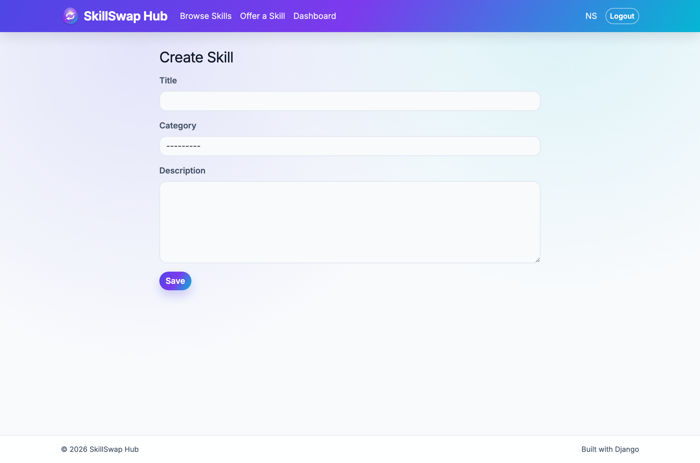

### Skill Details

### Exchange Dashboard

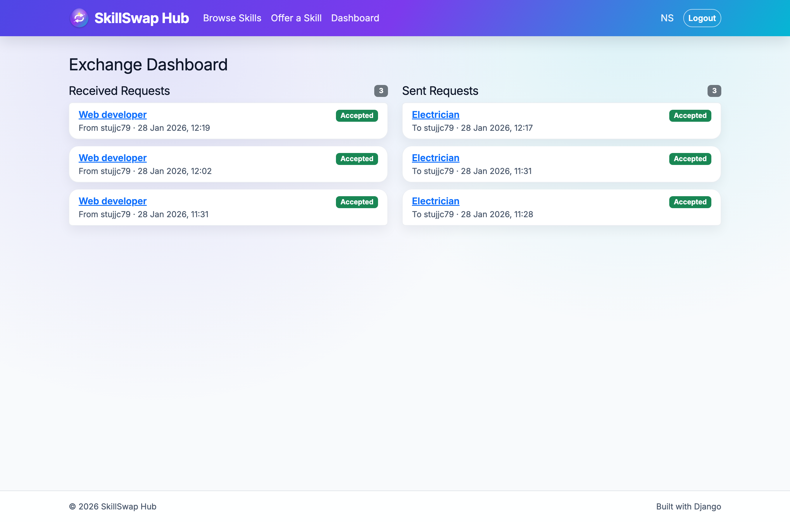

## Wireframes

### Desktop

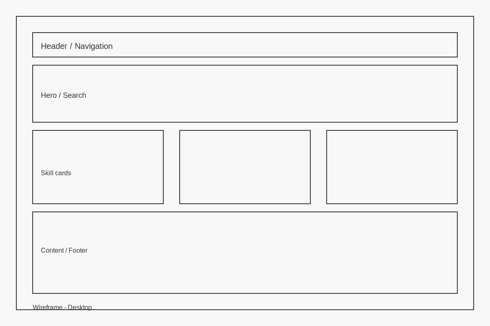

### Mobile

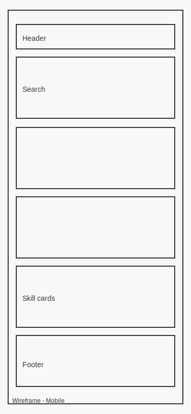

### Login

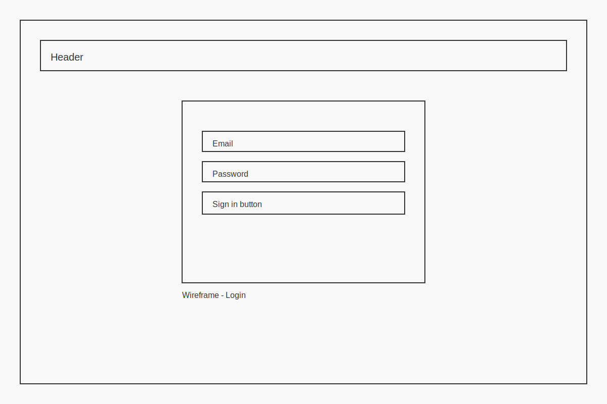

### Register

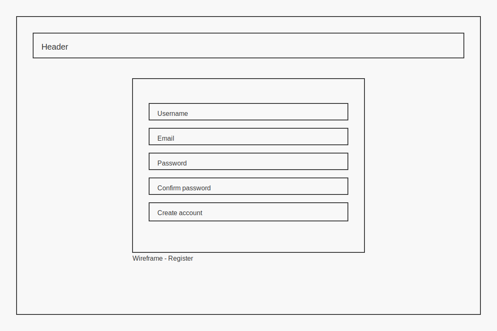

### Offer Skill

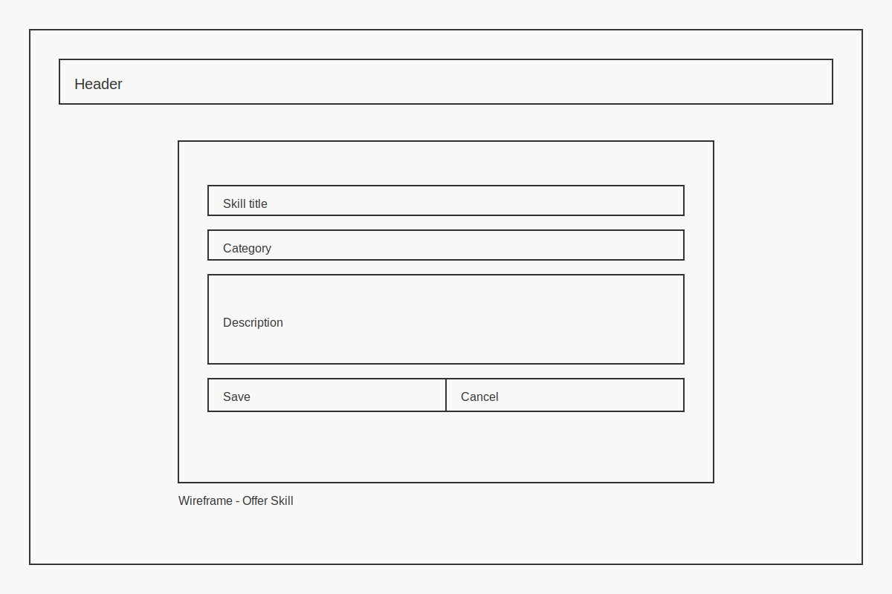

### Skill Details

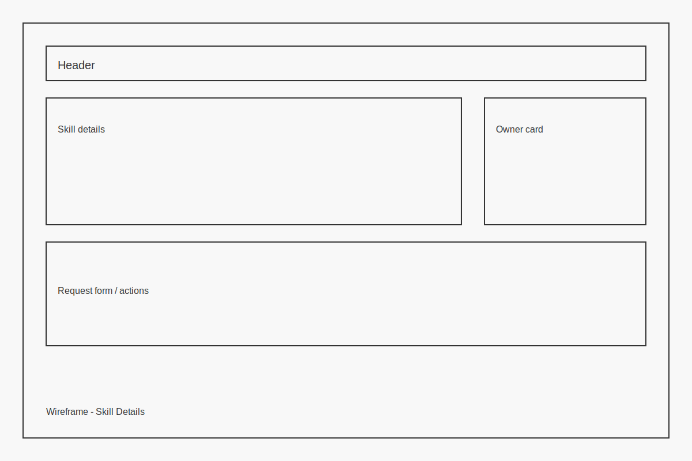

### Exchange Dashboard

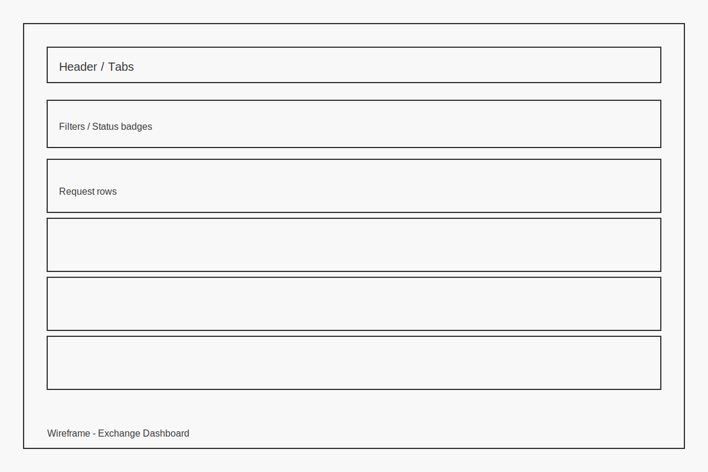

## Tech Stack

- Django
- SQLite (development)
- HTML/CSS

## Setup

1. Create and activate a virtual environment.
2. Install dependencies:
   - `pip install -r requirements.txt`
3. Apply migrations:
   - `python manage.py migrate`
4. Run the server:
   - `python manage.py runserver`

## Environment Variables

Store secrets in environment variables and keep them out of version control. Typical variables:

- `SECRET_KEY`
- `DEBUG`
- `ALLOWED_HOSTS`

## Testing

Run the test suite:

- `pytest`

## Accessibility

- HTML templates include clear labels, error messages, and feedback.
- Navigation and forms are designed to be keyboard-friendly.
- Contrast and layout are optimized for readability.

## Deployment

- The project includes `Procfile` and `runtime.txt` for platform deployments.
- Configure production settings for security (e.g., `DEBUG=False`, secure cookies, allowed hosts).
- Use environment variables for secrets and database configuration.

## Security

- Do not commit secrets.
- Use Django’s built-in authentication and CSRF protection.
- Ensure database and credentials are not stored in the repository.

## Database Schema (ERD)

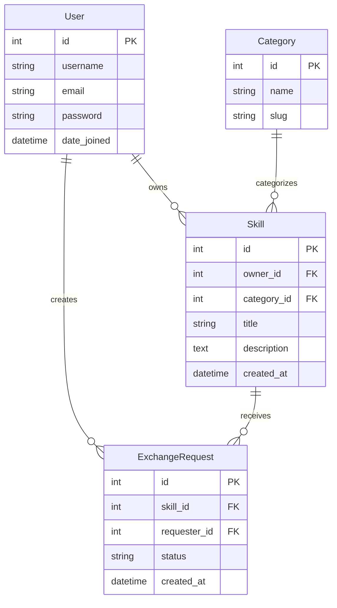

The database consists of four main models:

- **User** (Django's built-in auth model): Manages user authentication and profiles
- **Category**: Organizes skills into categories with URL-friendly slugs
- **Skill**: Core entity representing skills users can offer, owned by users and optionally categorized
- **ExchangeRequest**: Tracks requests between users for skill exchanges with status (pending, accepted, rejected, cancelled)

Key relationships:

- Users can own multiple skills and create multiple exchange requests
- Skills belong to one user and optionally one category
- Exchange requests link a requester (User) to a specific skill
- Categories can contain multiple skills

## User Stories (MoSCoW)

### Must Have

1. **Register an account**
   - As a new user, I want to create an account so I can list and request skills.
2. **Log in and log out**
   - As a user, I want to log in and log out so my account stays secure.
3. **Browse skills**
   - As a visitor, I want to browse available skills so I can find an exchange.
4. **View skill details**
   - As a user, I want to view a skill’s details so I can decide whether to request it.
5. **Create a skill listing**
   - As a user, I want to create a skill listing so I can offer my skills to others.
6. **Request a skill exchange**
   - As a user, I want to request a skill exchange so I can trade with another user.
7. **Manage requests**
   - As a skill owner, I want to accept or reject requests so I can control who I exchange with.

### Should Have

1. **Edit and delete skills**
   - As a user, I want to edit or remove my listings so they stay accurate.
2. **View my request dashboard**
   - As a user, I want to see sent and received requests so I can manage exchanges.
3. **Filter and sort skills**
   - As a user, I want to filter and sort skills so I can find relevant listings faster.
4. **Status feedback**
   - As a user, I want to see clear request status (pending/accepted/rejected/cancelled) so I know what’s happening.

### Could Have

1. **Categories for skills**
   - As a user, I want to categorize skills so browsing is easier.
2. **Search by keyword**
   - As a user, I want to search by keyword so I can quickly find specific skills.
3. **Accessible UI hints**
   - As a user, I want accessible feedback and tooltips so the UI is easy to understand.

### Won’t Have (for now)

1. **Real-time chat**
   - As a user, I want live chat so I can negotiate exchanges in real time.
2. **Payment handling**
   - As a user, I want to pay for premium features so I can unlock extra services.
3. **Ratings and reviews**
   - As a user, I want to rate exchanges so I can build trust in the community.

## Project Structure

- `accounts/` user auth and profiles
- `skills/` skill listings and CRUD
- `exchanges/` exchange requests and workflow
- `core/` project configuration
- `templates/` HTML templates
- `tests/` automated tests

## AI Tooling (Reflection)

AI-assisted tooling was used as a supportive development aid during the planning and implementation of this project. All final code decisions, integration, and testing were performed by the developer.

AI was used to:

- 📐 Planning & Architecture
  - Assist in breaking down user stories into technical tasks aligned with Agile methodology.
  - Suggest database relationships and model responsibilities during early ERD design.
  - Help validate Django app separation (accounts, skills, exchanges) against best-practice conventions.
- 🧠 Problem Solving & Debugging
  - Provide explanations of Django error messages and tracebacks to support debugging.
  - Suggest alternative approaches to view logic and form validation where initial implementations failed.
  - Help reason about permission handling and request lifecycle states (pending, accepted, rejected, cancelled).
- 🧪 Testing Support
  - Generate initial test case outlines for:
    - Exchange request workflows
    - Model validation logic
    - View-level access control
  - Assist in refining pytest structure and fixture usage.
  - Support interpretation of failing tests and refactoring towards passing outcomes.
- ♿ Accessibility & UX
  - Provide guidance on:
    - Semantic HTML structure
    - Form labelling and error feedback
    - Keyboard navigation expectations
  - Assist with contrast and layout recommendations for readable UI.
- 📄 Documentation
  - Drafted and refined:
    - README structure and technical descriptions
    - User stories (MoSCoW prioritisation)
    - Feature summaries and setup instructions
  - Assisted in writing clear commit messages and pull request descriptions.

### Responsible AI Use

AI tools were used strictly as a development assistant, not as an autonomous code generator. All outputs were:

- Reviewed manually
- Adapted to project requirements
- Tested locally
- Integrated selectively

This approach reflects real-world software engineering workflows, where AI can be used as a productivity aid, not a replacement for developer understanding or accountability.
